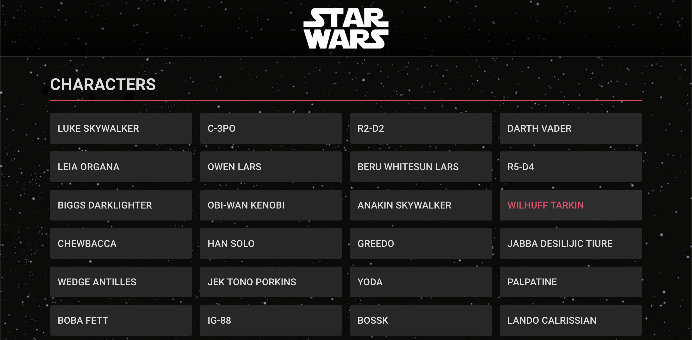

# Star Wars Universe

## Live Version

- https://star-wars-universe-a788f.web.app/people

## Getting Started

- `yarn`
- `yarn start`

## Description

User Stories:

- View all people in the Star Wars universe (/people)
- View the details of every person in the Star Wars universe (/people/:personId)

## Future Implementations

- Search functionality
- Testing

## Built With

- [React](https://reactjs.org)
- [Redux](https://redux.js.org)
- [React Redux](https://react-redux.js.org)
- [Redux Thunk](https://github.com/reduxjs/redux-thunk)
- [Axios](https://github.com/axios/axios)
- [React Router](https://github.com/ReactTraining/react-router)
- [Material UI](https://material-ui.com)
- [React Infinite Scroller](https://github.com/CassetteRocks/react-infinite-scroller)

## Acknowledgements

- Darth Vader icon by [Icons8](https://icons8.com/icons/set/darth-vader)
- Star Wars icon by [Icons8](https://icons8.com/icons/set/star-wars)
- Starfield background by [Star Wars](https://www.starwars.com/news/star-wars-backgrounds)
- [The Star Wars API](https://swapi.dev)
